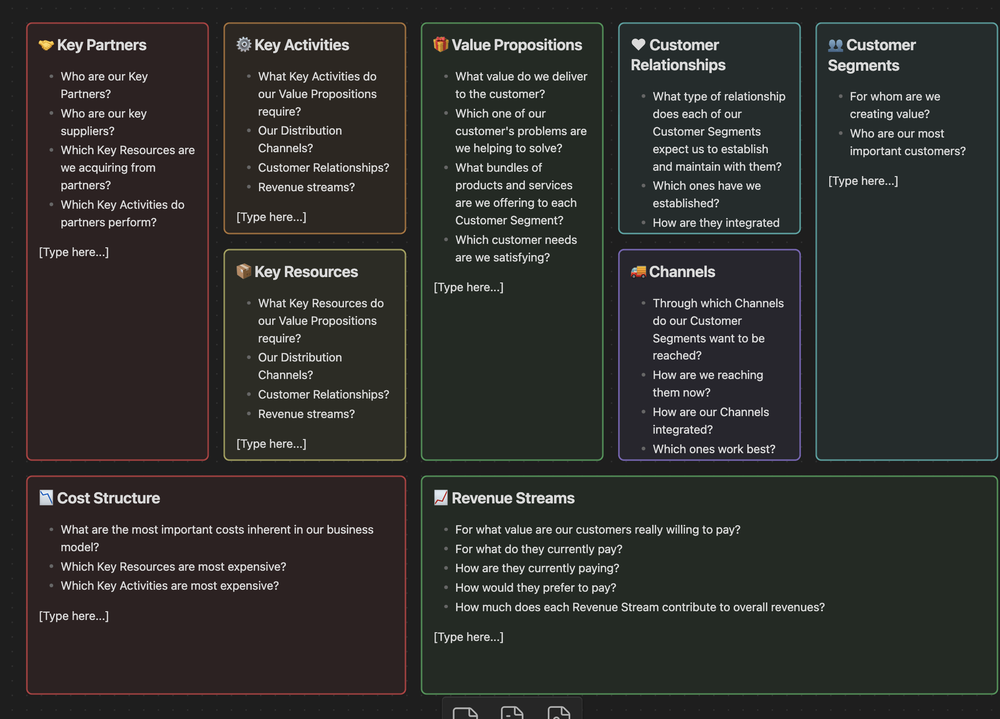

# Strategist Toolkit — Business Model Canvas for Obsidian

Generate a complete, color-coded Business Model Canvas (BMC) as an Obsidian Canvas file with one click or via the command palette.



If the image above does not render in your environment, the absolute path on this machine is:
/Users/sovitp/Documents/psovit/projects/obs-plg-bmc/screenshot.png

## Features

- Command palette action: “Create Business Model Canvas”.
- Ribbon button in the left sidebar to trigger the generator.
- Modal prompt for a Business/Project name; used in the file name.
- Creates the canvas in the same folder as the currently active file (or vault root if none).
- Nine cards arranged in the classic BMC grid with non-overlapping coordinates.
- Distinct colors for cards using Canvas color IDs.
- Emoji-enhanced headings and prompting questions for each card.
- Placeholder “[Type here…]” added to each card to guide editing.

## Commands and UI

- Command: Create Business Model Canvas
  - Opens a modal asking for the business name.
  - Creates “<Business Name> - Business Model Canvas - YYYY-MM-DD.canvas”.
  - Automatically opens the canvas after creation.
- Ribbon icon: dashboard-style icon labeled “Create Business Model Canvas”.
  - Click to launch the same generator flow as the command palette.

## Installation (Manual)

1. Build the plugin:
   - `npm install`
   - `npm run build`
2. Copy the release files to your vault:
   - From this repo root, copy `main.js` and `manifest.json` into:
     `<YourVault>/.obsidian/plugins/obsidian-strategist-toolkit/`
3. Reload Obsidian and enable the plugin in:
   - Settings → Community plugins → Installed plugins.

## Development

- Scripts:
  - `npm run dev` — watch mode (esbuild)
  - `npm run build` — production build
  - `npm run lint` — lint the project

- Recommended workflow (symlink to your vault):
  ```bash
  ln -s "/Users/sovitp/Documents/psovit/projects/obs-plg-bmc" "<YourVault>/.obsidian/plugins/obsidian-strategist-toolkit"
  ```
  Then run `npm run dev` and reload the plugin in Obsidian to see changes.

## How It Works

- Entry point: [main.ts](file:///Users/sovitp/Documents/psovit/projects/obs-plg-bmc/src/main.ts)
  - Registers the command and adds the ribbon button.
- Command logic: [create-bmc.ts](file:///Users/sovitp/Documents/psovit/projects/obs-plg-bmc/src/commands/create-bmc.ts)
  - Prompts for business name and creates the `.canvas` file in the current folder.
  - Handles file name conflicts and opens the canvas.
- UI modal: [BusinessNameModal.ts](file:///Users/sovitp/Documents/psovit/projects/obs-plg-bmc/src/ui/BusinessNameModal.ts)
  - Simple modal to collect the business name.
- Layout generator: [bmc.ts](file:///Users/sovitp/Documents/psovit/projects/obs-plg-bmc/src/bmc.ts)
  - Defines nine text nodes with coordinates, sizes, emoji titles, color IDs, and “[Type here…]” placeholders.

## Troubleshooting

- Command not visible
  - Ensure the plugin is enabled in Settings → Community plugins.
- Canvas not created in expected folder
  - The plugin uses the currently active file’s folder. Open a file in the desired folder before running the command.
- Filename conflicts
  - The plugin appends “(1)”, “(2)”, etc., if a file with the same name exists.

## Minimum Requirements

- Obsidian `minAppVersion`: 1.4.0 (see [manifest.json](file:///Users/sovitp/Documents/psovit/projects/obs-plg-bmc/manifest.json))

## License

0BSD
